## Reference based sketch extraction via attention mechanism
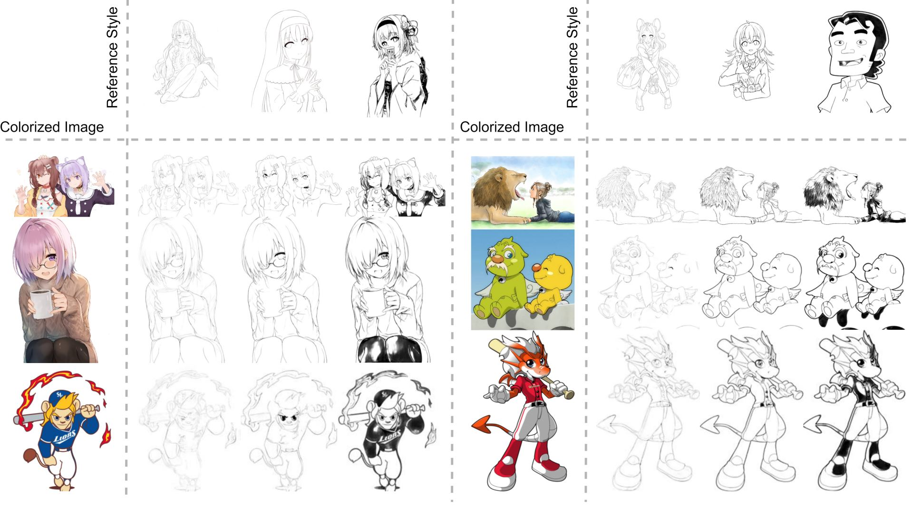

This is official implementation of the paper **"Reference based sketch extraction via attention mechanism"**

[PAPER](https://dl.acm.org/doi/10.1145/3550454.3555504)

Journal: ACM TOG\
Conference: SIGGRAPH ASIA 2022

        
## Train
    $ python main.py --mode train_deep \
                     --scope ref2sketch \
                     --name_data examples \
                     --dir_data ./datasets \
                     --dir_log ./log \
                     --dir_checkpoint ./checkpoint \
                     --direction a2b
                     --gpu_ids 0

* For settings from original paper, use 'train' for --mode. However we recommend to use 'train_deep' for producing better quality of model with deeper convolution layers.
* To understand hierarchy of dataset, see **Dataset directories structure** below. 

## Test
    $ python test.py --name_weight [weight_file] \
                     --name_data examples \
                     --direction A2B \
                     --cuda

* Download the pretrained model from google drive
https://drive.google.com/drive/folders/1OvU4pPVTFk07Kp5qKS6MNlsKhoUUckcR?usp=sharing
* Pretrained model "ref2sketch" produce results same as experiments on paper, however we recommend to use "ref2sketch_deep" for better quality output.

## Dataset
* Due to the regulation of twitter, we share each url of twitter dataset used in our paper. You can find twitter_dataset.json file from dataset folder.

**Twitter regulation**\
https://developer.twitter.com/en/developer-terms/agreement-and-policy

## Dataset directories structure
    ref2sketch
    +---[dir_data]
    |   \---[name_data]
    |       +---test
    |       |   +---a
    |       |       |   +---test_input1.png
    |       |       |   +---test_input2.png
    |       |   +---b
    |       |       |   +---test_groundtruth1.png #not necessary for testing
    |       |       |   +---test_groundtruth2.png #not necessary for testing
    |       |   +---c
    |       |       |   +---style1.png
    |       |       |   +---style2.png
    |       +---train
    |       |   +---a
    |       |       |   +---train_input1.png
    |       |       |   +---train_input2.png
    |       |   +---b
    |       |       |   +---train_groundtruth1.png
    |       |       |   +---train_groundtruth2.png
    
    #Paired input and groundtruth should have same filename

## Examples
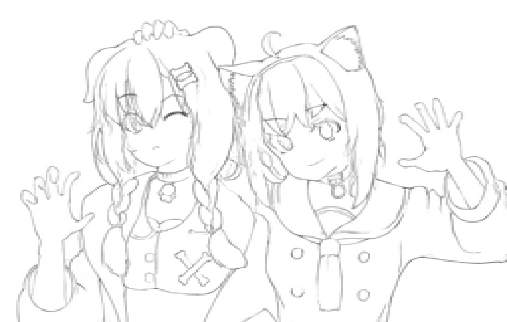

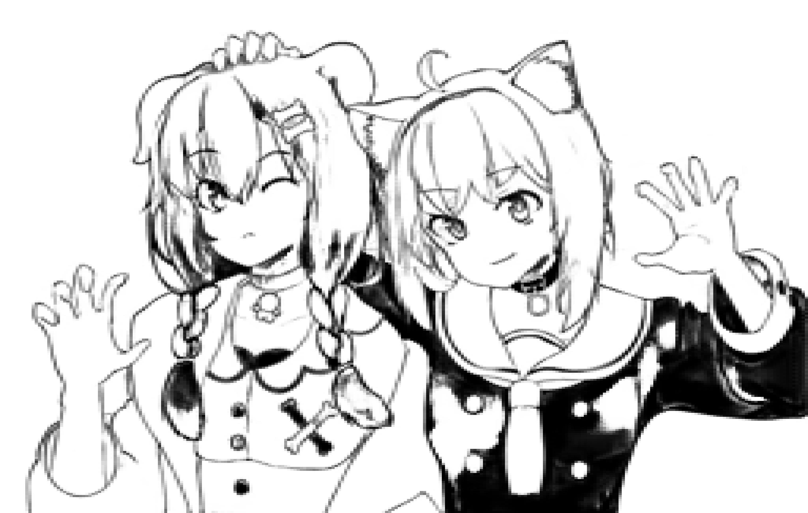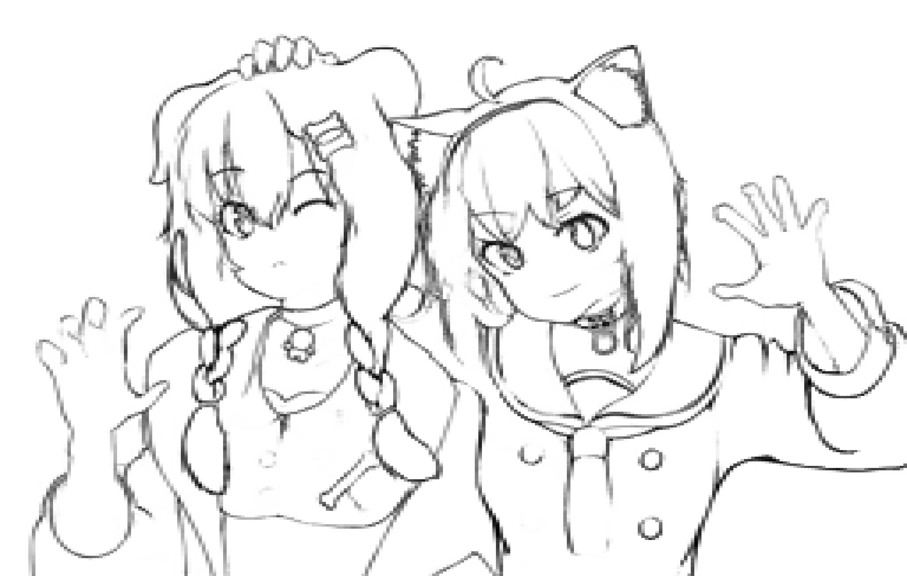

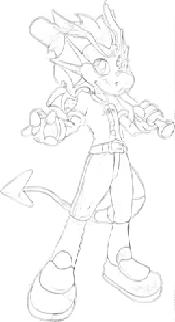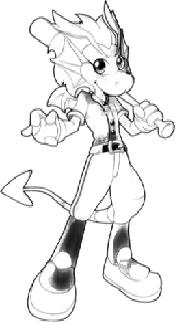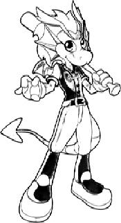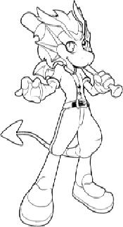

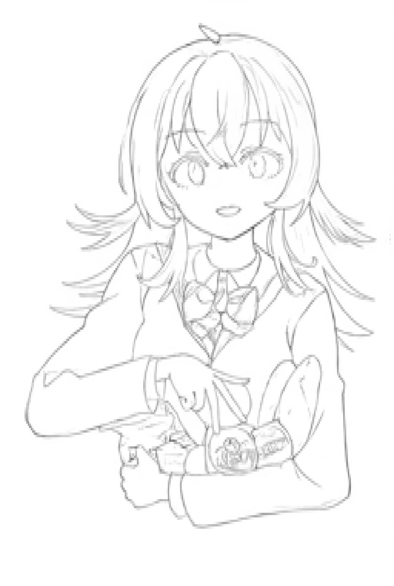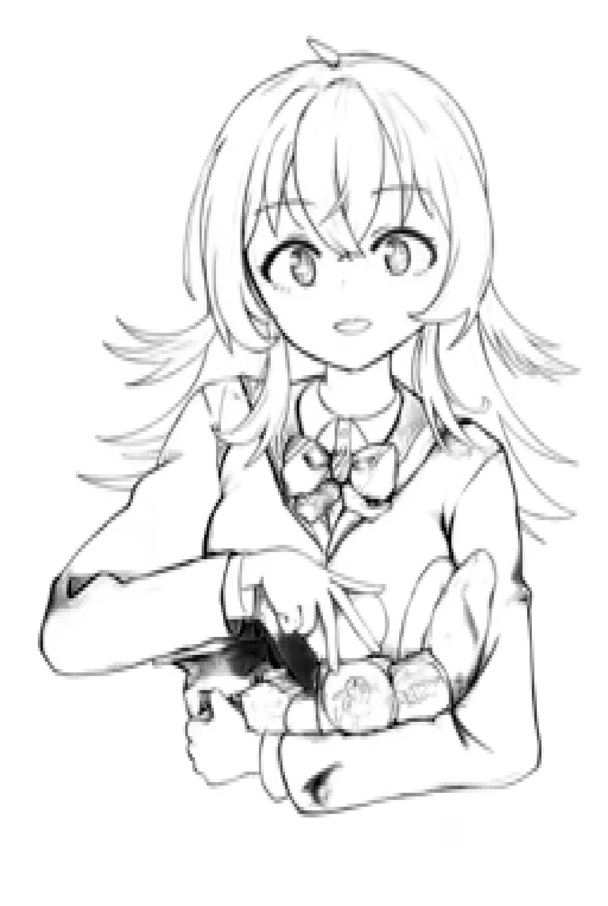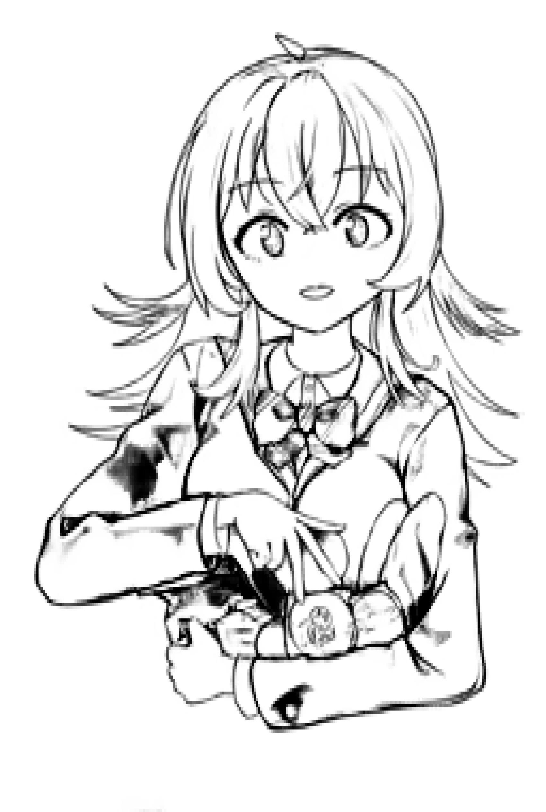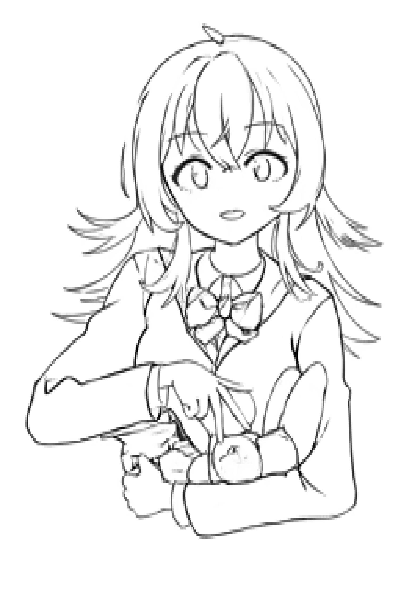

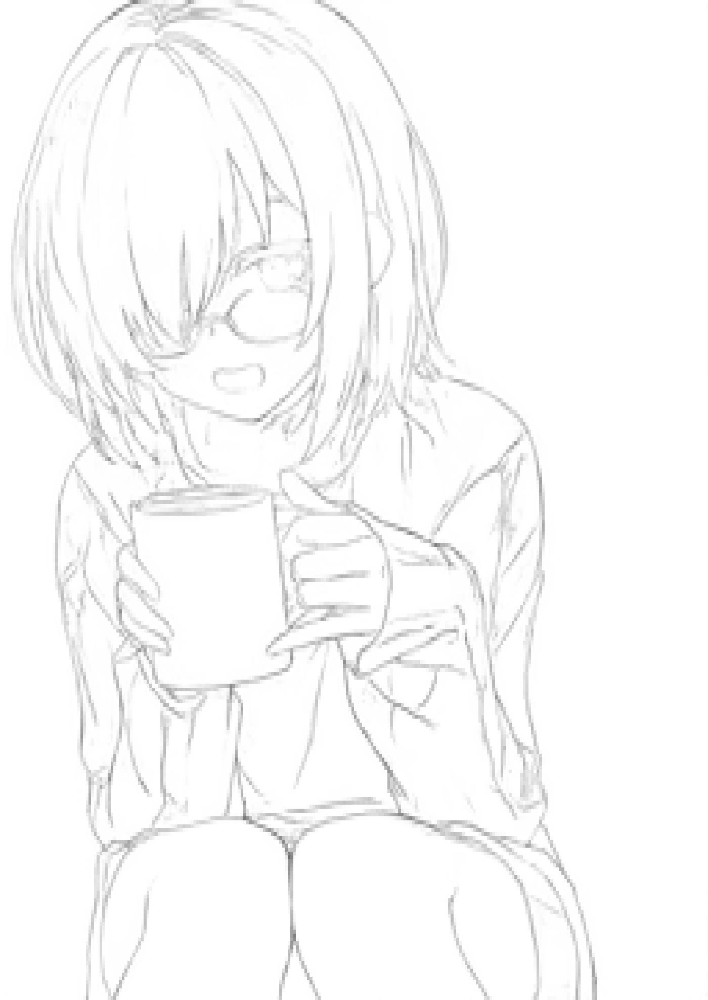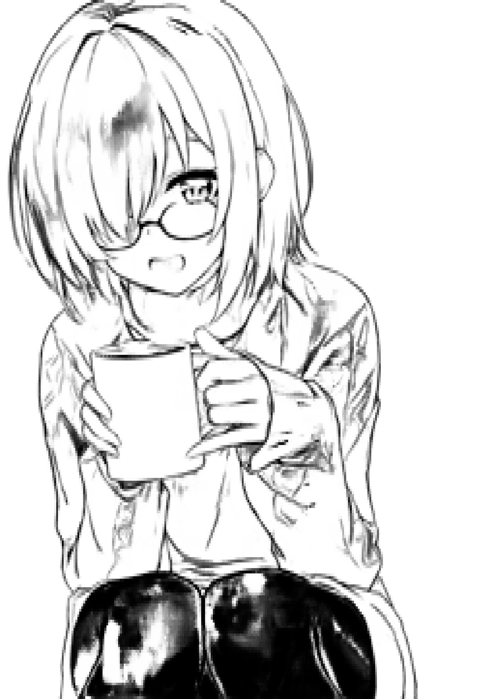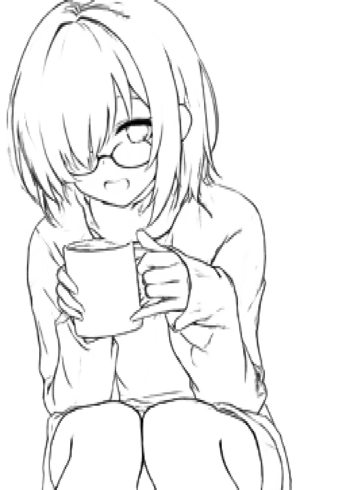

---
